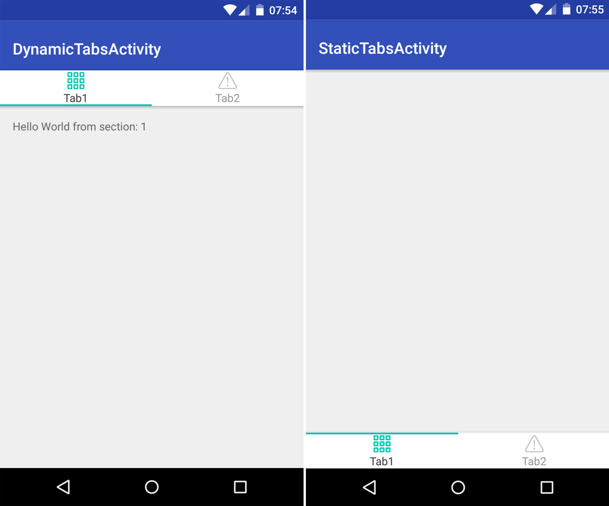

[](https://jitpack.io/#yaroslav-v/tab-layout) [](https://android-arsenal.com/api?level=14)

# Extended TabLayout from Android Design Library



Extended TabLayout from Android Design Library with some additions for better handling of tabs switching and placement of tab bar on the screen.

# Demo

Demo apk you can find in the /app folder of this repository.

# Features

* Can be used instead of TabLayout from Android Design Library in all cases (as top or bottom tab bar)
* Can be used together with Android Design Library
* Supports both top or bottom placements in the layout
* Icon and text in tab can be oriented horizontally (default) and vertically
* Tab indicator can be placed at the top or bottom of tab
* Added specific OnTabAnimationListener to handle start and end events of indicator animation
* Added speficic method Tab#updateSelected to fix status of icon for initial tab when using ViewPager

# Usage

Define `TabLayout` in xml layout with custom attributes.
```xml
<com.gibstudio.tablayout.TabLayout
    android:id="@+id/tabs"
    android:layout_width="match_parent"
    android:layout_height="wrap_content"
    android:layout_alignParentBottom="true"
    android:background="@android:color/white"
    android:elevation="@dimen/bottom_tabbar_elevation"
    app:tabGravity="fill"
    app:tabIndicatorColor="@color/parent_color_primary"
    app:tabIndicatorGravity="top"
    app:tabMaxWidth="0dp"
    app:tabMode="fixed"
    app:tabOrientation="vertical"
    app:tabPaddingTop="@dimen/bottom_tabbar_padding_vertical"
    app:tabSelectedTextColor="@color/text_color_dark"
    app:tabTextAppearance="@style/AppTheme.Navigation" />
```

Set up with the ViewPager.
```java
mViewPager = (ViewPager) findViewById(R.id.container);
mViewPager.setAdapter(mSectionsPagerAdapter);

TabLayout tabLayout = (TabLayout) findViewById(R.id.tabs);
tabLayout.setupWithViewPager(mViewPager);
```

Or add tabs directly.
```java
mTabLayout = (TabLayout) findViewById(R.id.tabs);
mTabLayout.addTab(mTabLayout.newTab().setText(R.string.title_tabbar_tab1)
        .setIcon(R.drawable.tabbar_tab1));
mTabLayout.addTab(mTabLayout.newTab().setText(R.string.title_tabbar_tab2)
        .setIcon(R.drawable.tabbar_tab2));
```

# Custom attributes

| attr  | description |
| ------------- | ------------- |
| tabIndicatorGravity    | Indicator gravity: top or bottom |
| tabOrientation   | Tab orientation: horizontal or vertical (like in LinearLayout) | 


# Download

Step 1. Add the JitPack repository to your build file.
```
repositories {
    // ...
    maven { url "https://jitpack.io" }
}
```

Step 2. Add the dependency.
```
dependencies {
    compile 'com.github.yaroslav-v:tab-layout:1.0.6'
}
```

That's it! The first time you request a project JitPack checks out the code, builds it and serves the build artifacts. 

# Copyright
```
Copyright 2016 Yaroslav Veykov, Genie in a Bottle studio

Licensed under the Apache License, Version 2.0 (the "License");
you may not use this file except in compliance with the License.
You may obtain a copy of the License at

http://www.apache.org/licenses/LICENSE-2.0

Unless required by applicable law or agreed to in writing, software
distributed under the License is distributed on an "AS IS" BASIS,
WITHOUT WARRANTIES OR CONDITIONS OF ANY KIND, either express or implied.
See the License for the specific language governing permissions and
limitations under the License.
```
